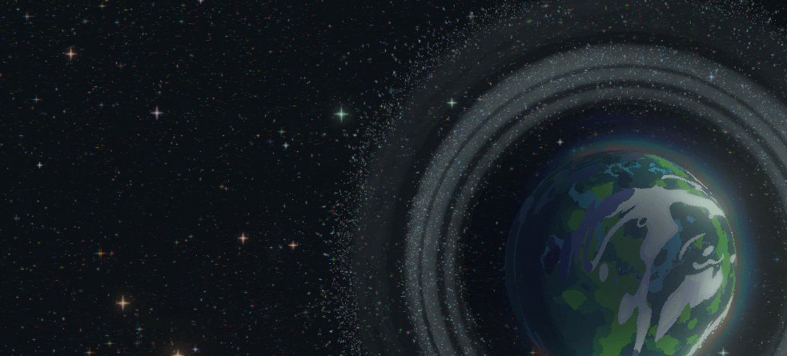

# Stardawn
State-of-the-art **Bevy-Lunex** UI implementation.

*Note: The development is still on-going, this example is NOT finished and is a subject of change.*

## === Showcase ===

## === Licensing ===
The **CODE** is released under both [APACHE](./LICENSE-APACHE) and [MIT](./LICENSE-MIT) licenses.
**THE ASSETS ARE NOT INCLUDED!** I do not provide license to use these assets here, only the code.
